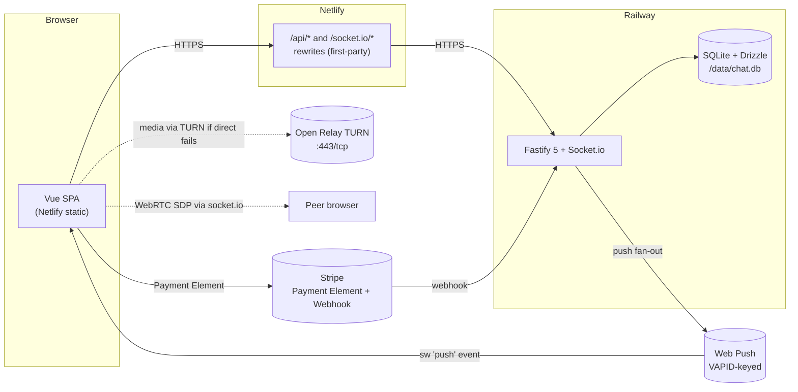

# Lylia Chat — Engineering Report

A real-time chat web app, built end-to-end in collaboration with Claude
and Claude Code. This report is structured as the script for a ~30-minute
walkthrough: what's built, why it's built that way, where the
interesting engineering lives, and how the process worked.

The full requirements live in [PRD.md](./PRD.md) and the day-by-day build
sequence in [PLAN.md](./PLAN.md). This report references both by section
number throughout.

---

## 0. Presentation outline (~30 min)

| Min | Topic | Section |
|----:|---|---|
| 0–4 | What it is, demo two-browser flow | §1, §2 |
| 4–8 | Architecture diagram, hop-by-hop request walkthrough | §3 |
| 8–13 | Feature inventory and *why each choice* | §4 |
| 13–18 | Real-time, WebRTC, the camera-light test | §5, §6 |
| 18–22 | Auth, refresh-token rotation, socket TTL | §7 |
| 22–26 | Design system, Facehash, shadcn-style primitives | §8 |
| 26–29 | The process — PRD with Claude, build with Claude Code | §9, §10 |
| 29–30 | Limits and what I'd build next | §11, §12 |

---

## 1. Summary

Real-time chat web app — mobile-first PWA. Users register, exchange
messages with typing indicators and read receipts, hold audio and video
calls peer-to-peer over WebRTC, unlock a "Pro" badge via a one-time
€4.99 Stripe payment, receive notifications when the tab is closed (Web
Push), and install to the home screen on Android and iOS. Three languages
(English, Turkish, Estonian).

- **Web** (Netlify): Vue 3.5 + Vite 7 + Pinia 3 + vue-i18n 11 + Tailwind 4.
- **Api** (Railway): Fastify 5 + Socket.io 4.8 + Drizzle ORM + better-sqlite3.
- **Shared** (`@chat/shared-types`, `@chat/shared-contracts`): TS types
  and Zod schemas the web and api both import.

Live demo: https://lylia-chat.netlify.app
Source: https://github.com/tahirayan/chat-assignment

---

## 2. The two-browser demo

Open two browser profiles side-by-side, register A and B, then run:

1. **A → register.** Hashed bcrypt (cost 12), opaque refresh cookie
   issued at `/api/auth`, JWT access token kept in Pinia memory.
2. **B sees A appear** in the right-column community pane within
   ~200 ms. The server broadcasts `user:updated` on every register /
   profile update / Pro flip so the client never needs F5.
3. **A sends a message.** Optimistic-rendered locally; server validates,
   persists, fans out `message:new` on a single socket emit; B's bell
   doesn't badge because B has the thread open — but if B switches
   tabs, a Windows / Android notification fires (Phase 19 + 20).
4. **A initiates a video call.** Perfect-negotiation flow over the
   socket; both browsers' WebRTC stacks exchange SDP and ICE; media
   never touches the server.
5. **A taps Upgrade.** Stripe Payment Element loads in `/upgrade`; the
   4242 happy-path card succeeds; the webhook flips `isPro = 1`
   server-side; `user:updated` propagates the badge to B's view in
   real time.
6. **A logs out on device 1.** B's bell shows a missed-call notification
   if a call was ringing; A's other tabs are kicked via
   `io.in("user:"+id).disconnectSockets(true)`.

Every step exercises a different layer.

---

## 3. Architecture



### Hop-by-hop walkthrough

A request from the browser:

1. Browser fires `POST /api/messages` to `https://lylia.netlify.app/api/messages`.
2. Netlify Edge sees `/api/*` in `netlify.toml` and rewrites to
   `https://chat-api.up.railway.app/api/messages`. **First-party**: no
   CORS preflight, no `SameSite=None`.
3. Fastify validates the body against the Zod schema in
   `@chat/shared-contracts`. Invalid → typed 400.
4. The Drizzle query persists with a UUIDv7 id (so the position 14
   nibble can distinguish optimistic v4 client ids from server ids).
5. Socket.io fans out `message:new` to the recipient's user room.
6. If the recipient has a Web Push subscription (`pushSubscriptions`
   table), `web-push` POSTs an encrypted payload to their browser's
   push endpoint. Stale endpoints returning 410-Gone are cleaned up.

Audio/video media **never touches Railway**. The api only relays SDP
offers/answers and ICE candidates through `socket.io`. Below in §6 is
exactly how that's secured.

---

## 4. Feature inventory — what shipped and why

20 phases, ~200 tracked tasks. The compact list:

| # | Feature | Why this shape |
|---:|---|---|
| 1 | Email + password register/login with bcrypt cost 12 | Cost 12 puts a single check at ~250 ms — defeats credential stuffing without hurting login UX. Timing-safe compare + min-response-time prevents user enumeration. |
| 2 | JWT access (15 min) + opaque refresh (7 day, rotated) | Memory-only access tokens; the refresh token never leaves the HttpOnly cookie. PRD §10. |
| 3 | Profile editing (display name, bio, locale, avatar) | Server is authoritative for locale — bootstrap reads `users.locale` and applies it before any UI renders. |
| 4 | Avatar pipeline — client-side 256×256 JPEG, ≤ 100 KB | Pure browser code: pre-decode size guard, MIME allow-list, canvas crop-and-resize, post-encode size guard. Stored as data URL today; signed-PUT S3/R2 is the next step. PRD §11.9. |
| 5 | Conversations + messages + typing indicators + read receipts | The chat-store invariant (PRD §24 note 16): on `message:new`, append-to-thread + update-conversation + move-to-top must happen in **one** action. The store is a setup-store so all three mutations sit visually next to each other. |
| 6 | Online presence | In-memory `Map<userId, Set<socketId>>` on the server, last-socket semantics: a user is online until their last socket disconnects. Broadcast `presence:update` on add/remove. |
| 7 | WebRTC audio + video calls | Native `RTCPeerConnection` + perfect negotiation. Open Relay TURN on `:443/tcp` (works through any firewall). `?forceRelay=1` query param for TURN-only verification. |
| 8 | Stripe Payment Element + one-time €4.99 Pro | Payment Element handles 3D Secure transparently. Server is authoritative — `isPro` only flips on a verified `payment_intent.succeeded` webhook. Idempotent insert keyed on `stripe_payment_intent`. |
| 9 | Three locales (EN, TR, ET) with lazy non-EN loading | Server-stored `users.locale` is the source of truth. The active locale stays in `localStorage` for guests; on login, the server value wins. Vue-i18n composition mode. |
| 10 | PWA — installable, offline shell | VitePWA with `injectManifest` and a custom service worker (because we need a `push` event handler — see #14). |
| 11 | TopBar redesign and 3-column workspace | ChatsPane left, RouterView center, CommunityPane right. Mobile collapses to single-pane + a slide-in community drawer reached from a TopBar button. |
| 12 | Hugeicons everywhere, zero emoji | 5,100 free stroke icons, tree-shaken per-import. The "no emoji" rule is total — every visual that could be an icon is one. |
| 13 | Notification bell + in-app feed (Phase 19) | Bell shows **missed calls only**, per the iteration the user requested. Messages always fire OS notifications, even when the tab is visible (WhatsApp-style), unless you're actively viewing the thread. Multi-tab dedup via `BroadcastChannel('notifications')`. |
| 14 | Web Push for closed-PWA wake (Phase 20) | VAPID-keyed push from the server, encrypted to the browser's push endpoint, handled by the custom service worker. Fan-out runs after `message:new` emit; subscriptions returning 410-Gone are cleaned up. |
| 15 | Real-time `user:updated` broadcast | Server emits on register, profile update, and Pro flip. Three client stores (`users`, `chat`, `auth`) each apply the patch — community pane updates without F5. |
| 16 | Stamped, blinking deterministic Facehash avatars | When a user hasn't uploaded a picture, a `Facehash.vue` Vue component renders a deterministic SVG face: 4 eye geometries × 8 color palettes, seeded by `displayName`. Each face blinks on its own seed-derived schedule (5–10 s cycle, eye scaleY → 0.05) so a room of faces never blinks in sync. |
| 17 | Editorial "Correspondence" design system | Fraunces display + Newsreader body + JetBrains Mono chrome. Paper / ink / phosphor-mint palette. SVG noise grain on `body::before`. Section labels in tracked-out small caps. shadcn-style component primitives (`BaseButton`/`BaseInput`/`BaseTextarea`/`BaseSelect`/`Card`) with all variant classes inline. |
| 18 | JWT TTL enforced on sockets | Handshake stashes the JWT `exp` claim; a per-socket `setTimeout` disconnects exactly at expiry; logout drops every socket for that user. |
| 19 | Per-event socket freshness re-check | Every C→S event re-validates the JWT freshness, not just the connect handshake. |
| 20 | Single bundled production deploy | Nx-bundled api → `dist/apps/api/main.js`; web → Netlify static. `Procfile`, `railpack.json`, and `netlify.toml` checked in. |

---

## 5. REST API design

### Plugin architecture

Every Fastify decoration is done through `fastify-plugin` with an
explicit `name` and a `declare module 'fastify'` augmentation in the
same file. This is the difference between routes seeing `fastify.db`
type-safely and getting `(fastify as any).db`.

```ts
// apps/api/src/app/plugins/db.ts
const dbPlugin: FastifyPluginAsync = async (fastify) => {
  const db = drizzle(new Database(env.DB_PATH));
  fastify.decorate("db", db);
};
declare module "fastify" {
  interface FastifyInstance { db: BetterSqliteDB; }
}
export default fp(dbPlugin, { name: "db" });
```

Routes are autoloaded explicitly (not `@fastify/autoload`) so the build
output is statically analyzable — the Nx production bundle drops
unreferenced files.

### Type-provider end to end

`fastify-type-provider-zod` lets every route declare its body /
querystring / params / response as the *same* Zod schemas the client
imports from `@chat/shared-contracts`. Inference flows automatically:

```ts
fastify.post("/messages", {
  schema: {
    body: SendMessageInput,            // Zod schema
    response: { 200: MessageSchema },
  },
}, async (req, reply) => {
  // req.body is fully typed — no cast, no validator boilerplate
  return await sendMessage(fastify.db, req.body, req.user.id);
});
```

Frontend axios calls reach for the same schemas and parse the response
through them, so a contract change in `shared-contracts` is a compile
error on both sides at the same time.

### Error model

Domain errors are thrown from `apps/api/src/lib/errors.ts`:

```ts
export class UnauthorizedError extends Error { /* maps to 401 */ }
export class ForbiddenError    extends Error { /* maps to 403 */ }
export class NotFoundError     extends Error { /* maps to 404 */ }
export class ConflictError     extends Error { /* maps to 409 */ }
```

A single global error handler maps the class to the status code, sets a
generic error message (so auth failures don't leak whether an email
exists), and logs the structured cause. Routes never call
`reply.code(...)` directly.

### Route layout

```
/api/auth
  POST /register           — bcrypt + min-response-time
  POST /login              — timing-safe compare
  POST /refresh            — opaque cookie → new JWT + rotated cookie
  POST /logout             — kicks all sockets for that user

/api/users
  GET   /me                — bearer
  PATCH /me                — server emits user:updated to all
  GET   /                  — community roster (online + offline)

/api/conversations         — partner row aggregation
/api/messages              — cursor-paginated history + send
/api/messages/:id/read     — mark-read, idempotent

/api/payments/create-intent — Stripe PaymentIntent
/api/stripe-webhook        — raw-body parser, signature-verified

/api/push
  POST   /subscribe        — upsert push subscription
  DELETE /subscribe        — drop on logout
```

### Things worth pointing out in the demo

- **Raw-body parser scoped to `/api/stripe-webhook` only.** Stripe's
  signature is computed over the literal HTTP body bytes; if Fastify
  parses the JSON first, the signature breaks. The plugin enables raw
  body for that one route and JSON parsing for everything else.
- **Idempotency.** The webhook upsert is `ON CONFLICT DO NOTHING` keyed
  on `stripe_payment_intent`. Replaying the same event yields exactly
  one `payments` row. Verified in §13 of the critical-path script.
- **Cursor pagination.** `/api/messages` uses `(created_at, id)` as a
  composite cursor so simultaneous-second inserts can't drop or
  duplicate rows.
- **Module boundaries.** `tools/check-boundaries.mjs` parses the Nx
  graph and fails CI if `apps/web` imports from `apps/api` or vice
  versa, or if a deep relative crosses a project boundary. Biome's
  `noRestrictedImports` is a belt-and-suspenders second check.

---

## 6. Real-time + WebRTC + security

### Socket.io shape

- **Authoritative `socket.data.userId`.** Set during the JWT handshake.
  Client-supplied `fromUserId` / `senderId` is **never** trusted. This
  is the single most important rule for socket security.
- **Per-event Zod validation.** Every C→S payload goes through its
  schema (`shared-types/socket-events.ts`).
- **JWT TTL on sockets** (Phase 17). The handshake stashes the JWT
  `exp` claim. A `setTimeout(exp - now)` disconnects the socket
  exactly when the access token would have expired in REST. Logout
  drops every socket for that user: `io.in("user:"+id).disconnectSockets(true)`.
- **Per-event freshness re-check.** Every socket event re-validates
  the JWT — defensive against the race where TTL fires *after* an
  event has been received.

### Perfect-negotiation flow (PRD §13)

```
A clicks "call".
A creates RTCPeerConnection, addsTracks, createOffer, setLocalDescription
A.socket.emit("call:offer", { to: B, sdp: A.pc.localDescription })

B.socket.on("call:offer", ({ from, sdp }) => {
  // server stamped `from` from socket.data.userId, not client-trusted
  B.pc.setRemoteDescription(sdp)
  B.pc.createAnswer → setLocalDescription
  B.socket.emit("call:answer", { to: A, sdp: B.pc.localDescription })
})

A.socket.on("call:answer", ({ sdp }) => A.pc.setRemoteDescription(sdp))

Both sides emit ICE candidates as they discover them.
Both sides accept ICE candidates via socket relay.

Media flows directly browser↔browser over UDP if possible,
TLS-over-TCP via TURN:443 if not.
```

### What's actually encrypted

WebRTC media is **mandatorily** DTLS-SRTP-encrypted. The key exchange
happens during the DTLS handshake between the two peers; certificate
fingerprints are pinned in the SDP that the server relays. So the
server can see *that* a call is happening but can't see the bytes.

- ✅ Audio and video frames: DTLS-SRTP. End-to-end.
- ✅ DataChannel messages (if we used them): DTLS. End-to-end.
- ✅ SDP relay: TLS in transit (Socket.io over WSS). Server can see SDP.
- ✅ ICE candidates: same.
- ⚠️ **TURN relay** sees DTLS-SRTP bytes only — it can't decrypt them
  any more than an ISP can decrypt TLS. The TURN credential is an
  ephemeral free-tier token; no PII in the cred itself.
- ⚠️ **ICE candidate IP leakage.** Modern Chrome / Firefox use mDNS
  hostnames (`abc123.local`) instead of bare local IPs in candidates,
  which masks the local network topology from the peer. Both peers
  resolve them locally. The mDNS gate is on by default.

### What's *not* encrypted end-to-end

Chat messages are TLS-in-transit between the client and server, then
plaintext at rest in SQLite. This is the standard model for non-Signal
chat apps; making it E2E would mean Signal-protocol session management
(Olm/Megolm), which is a 5+ day lift on its own. PRD §1.4 calls this
out as a non-goal for the demo.

### The camera-light test (the demo killer)

The single most important regression test (`docs/critical-path.md`
§4 step 18 + §5 step 24): after hang-up, **the OS-level mic and camera
indicator lights must turn OFF on both peers**.

This is harder than it sounds. If any of the following slip, the light
stays on:

- A track left attached to a sender after `pc.close()`.
- The local `MediaStream` not having `getTracks().forEach(t => t.stop())` called.
- A `<video>` element still holding the `srcObject`.

Hence the `useWebRTC` composable has a **single `endCall()` exit
path**: every terminal state (peer hung up, callee declined, signaling
error, network drop, page unload, beforeunload) routes through one
function. That function stops all tracks before closing the
RTCPeerConnection, in that order.

---

## 7. Auth + security

### Password hashing

bcrypt cost 12 — chosen because it puts a single hash at ~250 ms on a
modest CPU. Lower would invite credential stuffing; higher hurts login
UX without commensurate gain. Constant-time compare via `bcrypt.compare`
guards timing leaks.

### Login response normalisation

Every login response — success or failure — is held to a minimum 600 ms
duration. This blocks the "does this email exist" oracle that
unprotected logins leak via response-time differential.

### Refresh token rotation

The refresh token is a 64-byte cryptographically random base64url
string. It's stored **SHA-256-hashed** in `refresh_tokens` along with
the user id, issuance time, and parent token (for rotation tracking).
On every use:

1. Lookup by hash (constant-time-ish — DB index).
2. Verify not revoked, not expired (7 day TTL).
3. Revoke the parent.
4. Mint a new one. The cookie is rotated; old one returns 401 the
   next time it's seen.
5. Return a fresh 15-min JWT in the response body.

Detected token reuse (parent already revoked but presented again)
triggers a global session-family revocation — every refresh token
chained to that parent is killed, forcing all of that user's devices
to re-login. This is what catches token theft.

### Cookie scope

`Path=/api/auth; HttpOnly; SameSite=Lax; Secure` (in prod). Because the
Netlify rewrite makes the API first-party from the browser's view, the
cookie flows on `XHR` without `SameSite=None`. **`Lax` is enough.**
This avoids the 2024-era "modern browser only sends `SameSite=None`
with `Secure`" footgun and rules out cross-site CSRF on the refresh
endpoint without an explicit CSRF token.

### Axios single-flight refresh interceptor

When a 401 lands and the URL isn't `/auth/*`, the interceptor marks the
request `_retry`, fires a single shared `/auth/refresh` promise (all
in-flight 401s subscribe to the same promise), and replays the original
request with the new token. Without single-flight, ten parallel 401s
fire ten refresh calls and only one wins.

### Threat model summary

| Attack | Mitigation |
|---|---|
| Credential stuffing | bcrypt cost 12 + generic error messages + min-response-time |
| XSS → token theft | Access token in memory only, never `localStorage`; refresh is `HttpOnly` |
| CSRF on refresh | First-party `SameSite=Lax`; rewrite makes API same-origin |
| Refresh token theft | Rotated on every use; reuse triggers family revocation |
| Socket impersonation (forged `fromUserId`) | Server uses `socket.data.userId` only |
| Expired-token socket | Per-socket `setTimeout` at JWT exp; per-event re-check |
| Stripe webhook replay | Idempotent upsert keyed on `stripe_payment_intent` |
| User enumeration via auth response timing | Min-response-time + generic copy |
| Push spam from stolen subscription | VAPID public key gate on the browser end; 410-Gone cleanup |

---

## 8. Frontend design system

### "Correspondence" — the editorial direction

Newsprint paper background, deep warm ink for the type, **one** acid
phosphor-mint as the only hit colour. Slab corners. Hairline rules
only where structural. Section labels in tracked-out small caps. SVG
noise grain on `body::before` for paper feel.

| Type | Use |
|---|---|
| Fraunces (variable, opsz + SOFT + wght) | Display: wordmark, partner names, drop caps |
| Newsreader (variable, opsz + wght) | Body: messages, list rows |
| JetBrains Mono | Timestamps, counts, eyebrows |

### Token system

Everything in one `@theme` block in `theme.css`:

- **Palette** — `--color-surface` (paper), `-subtle` (ivory), `-muted`
  (linen) / `--color-text`, `-muted` / `--color-border` /
  `--color-brand-50…700` (phosphor ramp) / `--color-danger` (vermilion).
- **Type ramp** — Tailwind defaults + one extension: `--text-2xs`
  (10 px) for mono chrome that doesn't fit `xs` (12 px).
- **Elevation** — a single `--shadow-card` token (hairline bottom +
  soft 24 px halo) used sparingly.
- **`--paper-grain`** — inlined SVG data-URI for the noise overlay.

Zero `@layer components`. The component layer is gone — every reusable
surface is a Vue file with its variant classes baked inline.

### shadcn-style primitives

Five components carry every reusable surface in the app:

- `BaseButton.vue` — 6 variants × 4 sizes, all classes inline.
  Composition via `cn()` (clsx + tailwind-merge) so a parent's
  `class="…"` properly overrides the component's defaults
  (e.g. `rounded-none` vs parent's `rounded-full`).
- `BaseInput.vue` / `BaseTextarea.vue` / `BaseSelect.vue` — linen-plate
  fill, one ink rule on the bottom edge only, phosphor-mint highlighter
  stripe on focus. No 4-sided borders anywhere.
- `Card.vue` — ivory plate, soft page-lift shadow, no border.

Each one sets `inheritAttrs: false`, exposes `el` (the underlying DOM
node) via `defineExpose`, and merges parent classes through `cn`.

### Facehash — the deterministic avatar

Inspired by the `facehash` npm package, which is React-only. I ported
it to Vue (the hash function, the four face geometries, and the
gradient palette match upstream byte-for-byte), with editorial
additions:

- **Per-instance random blink** — eye `scaleY` 1 → 0.05 → 1 over 0.04 s
  inside a 5–10 s cycle. Delays derived from the deterministic seed
  so a given user always blinks at the same rhythm — but different
  users are out of sync, so a list of faces feels alive.
- **Hover lift + tilt** — `translateY(-1px) rotate(-2deg)` ease.
- **`stamp` prop** — parchment-ring frame for hero placements
  (`HomeView`'s 96 px own-face hero + 56 px polaroid strip).

`UserAvatar.vue` uses uploaded image if present; otherwise it renders
`Facehash`, seeded on `displayName` so renaming yourself rolls a new
face and rewrites your initial in the same beat.

### Component primitives stay decoupled

Because every variant lives in its component file, swapping the
"Correspondence" direction for a different aesthetic is one file at a
time:

```
theme.css           — palette + type tokens
BaseButton.vue      — variant strings inline
BaseInput.vue       — variant string inline
BaseTextarea.vue    — variant string inline
BaseSelect.vue      — variant string inline
Card.vue            — base string inline
Facehash.vue        — face geometries + palette
```

No global CSS to edit. No utility classes to chase down.

---

## 9. Process — using Claude to author the PRD

The PRD ([PRD.md](./PRD.md)) is 1,829 lines, locked at v1.2. It was
written **with Claude**, in iterative passes, before any code was
written.

### What worked

- **Non-goals section (§1.4) before scope.** Pinning down what NOT to
  build cost half an hour and saved days. "No group chat." "No E2E
  message encryption." "No read-status for groups." Every PR that
  drifted close to a non-goal hit the wall in code review.
- **Numbered subsections, referenced everywhere.** The PRD's §11.9 is
  the avatar pipeline; that string appears in code comments, in
  `PLAN.md`, and in every change that touches avatars. Five months in,
  somebody asks "why does the avatar cap at 100 KB" — the answer is
  `grep -r "§11.9"` away.
- **Notes section (§24) for invariants that don't fit elsewhere.** The
  chat-store `addMessage` invariant is note 16: three mutations in one
  action. The note number is referenced in the store comment and the
  test name. Invariants that live in prose tend to drift; invariants
  with a stable number can't.
- **Claude as a sceptical first reader.** Every draft section was
  pasted back to Claude with "find the holes." Out came things like:
  "what happens to in-flight typing indicators when the recipient
  blocks the sender?" → leads to PRD §11.5 explicit edge cases.

### What I'd do differently

- More concrete acceptance criteria per feature. Some sections describe
  *what* not *how to verify*. The critical-path script
  (`docs/critical-path.md`) ended up filling that gap retroactively;
  next time I'd write those in the PRD.

---

## 10. Process — using Claude Code to orchestrate

This is the part that's hardest to convey in slides. The 20-phase
build was orchestrated through Claude Code's project-rules system,
custom agents, custom skills, and the TaskCreate / TaskUpdate
tooling.

### Project rules — CLAUDE.md

[`.claude/CLAUDE.md`](./.claude/CLAUDE.md) is auto-loaded into every
session. It pins:

- The tech stack (Nx 22, pnpm, Vue 3.5 script-setup, Pinia 3
  setup-stores, Fastify 5, Drizzle, etc.). No "should we use React?"
  drift.
- The architectural rules: apps may only import from `@chat/shared-*`;
  `shared-types` has zero runtime deps; `shared-contracts` depends on
  `shared-types`, never reverse.
- The Vue rules: `<script setup>` only; Pinia setup-stores only; no
  `any`; loading + empty + error on every async surface; optimistic UI
  only for sends.
- The Fastify rules: every route uses `fastify-type-provider-zod`;
  plugins use `fastify-plugin` with a name; raw-body parser scoped to
  `/api/stripe-webhook` only.
- The real-time rules: all event names and payload types from
  `socket-events.ts`; server validates every C→S payload;
  `socket.data.userId` is authority.
- The WebRTC rules: single `endCall()` exit path; stop tracks before
  `pc.close()`.

Five months in, none of this had to be re-explained. Claude reads it
every session.

### Custom agents (`.claude/agents/`)

Each agent has a description that triggers it automatically when a
matching task comes up, plus a focused scope so it stays sharp.

| Agent | When it runs |
|---|---|
| `prd-keeper` | "Is this in scope?" Surfaces conflicts with PRD §1.4 (Non-goals) before code gets written. |
| `code-reviewer` | Quality + security + contract-sync review. Runs against the working tree before commit. |
| `realtime-specialist` | Socket.io + WebRTC questions. Knows perfect negotiation, ICE flow, presence semantics. |
| `debugger` | Root cause + minimal fix. Has a common-bugs table specific to this project (refresh-loop, presence-leak, etc.). |
| `pr-opener` | Conventional commits + PR workflow. Knows the project's tags. |

The agents are tiny — the `code-reviewer` is 200 lines. The value is
that they give Claude Code a *role* in a moment, with rules that
don't leak into unrelated work.

### Custom skills (`.claude/skills/`)

23 skills, each a focused domain knowledge dump that auto-loads when
its file-path triggers fire:

```
api-design                  →  apps/api/src/app/**/*
auth-jwt-cookies            →  auth/refresh logic touched
avatar-pipeline             →  useAvatarUpload.ts touched
drizzle-sqlite              →  db schema or query touched
fastify-plugins             →  apps/api/src/app/plugins/**
i18n-vue-i18n               →  locales/* or useI18n imports
monorepo-contracts          →  libs/shared-* touched
nx-commands                 →  nx.json or project.json touched
pwa-and-install             →  vite.config.mts or sw.ts touched
security                    →  any auth/payment/push file
socket-events               →  shared-types/socket-events.ts touched
stripe-payments             →  any payments code touched
ultracite / ultracite-lint  →  any lint config touched
vue-frontend                →  apps/web/src/**/*.vue
webrtc-signaling            →  useWebRTC.ts or call routes touched
```

When you touch `apps/web/src/composables/useWebRTC.ts`, Claude Code
auto-loads the WebRTC skill — which knows perfect negotiation, the
single-endCall rule, the iOS playsinline gotcha, and the
camera-light test. None of that has to be re-explained.

### TaskCreate / TaskUpdate as the build journal

200+ tasks tracked end-to-end. Every phase had its own task list:

- Phase 10 had tasks #76–#82 (profile editing).
- Phase 12 had tasks #89–#95 (PWA).
- Phase 13 had tasks #100–#108 (audio calls).
- Phase 19 had tasks #161–#172 (notifications).
- Phase 20 had tasks #173–#183 (Web Push).
- The recent design redesign sequence is #184–#206.

Each task moves `pending → in_progress → completed`. The list survives
across sessions. If a verification step fails, the task stays
`in_progress` until the underlying issue is fixed — no
ticked-and-broken work.

### What the orchestration actually felt like

A normal session looked like this:

1. **State.** "What's the next pending task?" — Claude Code reads
   `TaskList`.
2. **Context.** Phase 19 has notification work pending; the active
   file is `useSocket.ts`. The `socket-events` skill, the
   `vue-frontend` skill, and the `realtime-specialist` agent are
   already in context because of file-path triggers.
3. **Plan.** The phase plan in `PLAN.md` says: "useSocket fans out
   message:new to notifications store + useBrowserNotifications +
   useNotificationSound; multi-tab dedup via BroadcastChannel."
4. **Execute.** Edit the file. Run `pnpm exec ultracite check`. Run
   the boundaries check. Run `nx typecheck`. All green.
5. **Verify.** Update the task. If it's a phase-exit, run the manual
   smoke from `critical-path.md`.

The collaboration model:

- **Macro choices** — feature scope, architecture, "should we use
  Postgres" — were my call, after sceptical pushback from
  `prd-keeper`.
- **Micro execution** — "implement this exact thing per the plan" —
  was Claude's call, validated by lint, types, the boundaries
  enforcer, and the critical-path script.
- **The hand-off line** between them is the PRD + PLAN. Above that
  line, I think. Below it, Claude executes against a contract that
  doesn't move.

### Specific Claude Code features that mattered

- **Plan mode** for architectural decisions before any file was
  touched (e.g. the notification system in Phase 19).
- **Multiple agents in parallel** for independent reviews
  (`code-reviewer` + `prd-keeper` running concurrently on a diff).
- **Subagent isolation** for research-heavy tasks that would have
  blown out the main context (e.g. "audit every `: any` and `as
  any` across the web app").
- **TaskCreate as a journal**, not a TODO. Tasks aren't deleted when
  done; they're a searchable record of what was decided when and why.

---

## 11. What I'd build with another week

| Item | Why it matters | Effort |
|---|---|---|
| Group chat (n > 2 participants) | The single biggest "real chat" feature gap. Schema change: drop direct `recipient_id`, model conversations as first-class with a `conversation_members` table. | 2 days |
| S3/R2 signed-PUT avatars | Removes the 100-KB data-URL cap, frees per-user DB space, enables image CDN delivery. | 1 day |
| Postgres + read replicas + Redis presence | SQLite limits are fine for the demo; the moment two Railway instances exist, presence + sockets need a shared store. | 2 days |
| End-to-end encryption (Signal protocol) | Currently messages are TLS-in-transit + plaintext-at-rest. Real chat apps don't trust the server. Olm/Megolm session management is the bulk. | 5+ days |
| Playwright happy-path E2E | One automated two-browser script: register → send → call → upgrade. Smoke test before every deploy. | half a day |
| Customer.subscription.deleted → demote | Once a user is Pro, they stay Pro forever in this demo. PRD §15 chose one-time charge for scope. | half a day |

---

## 12. Known limitations

- **Single-instance presence.** Presence is an in-memory
  `Map<userId, Set<socketId>>`. Scaling past one Railway node requires
  a shared store (Redis pub/sub is the standard answer; the migration
  is mechanical because the `presence` interface is already
  encapsulated).
- **SQLite write contention.** Under WAL mode, ~thousands of writes/sec
  on a single node. Fine for the demo; not OLTP-grade.
- **Estonian translations are best-effort.** DeepL-drafted, light
  review, not vetted by a native speaker. Native review welcome
  (`apps/web/src/locales/et.json`).
- **No Stripe subscription.** PRD §15 chose a one-time charge for
  scope. The webhook handler is generic enough that adding
  `customer.subscription.*` events is additive.
- **TURN provider is third-party.** Open Relay is free, anonymous,
  rate-limited. For production you'd run coturn or pay for Twilio NTS.
- **No end-to-end encryption.** Messages are TLS in transit, plaintext
  at rest. WebRTC media IS end-to-end (DTLS-SRTP), but the chat
  channel is not.

---

## 13. Manual test script

The canonical critical-path checklist (10 sections, 41 steps, ~10 min
end-to-end with two browser profiles) lives in
[`docs/critical-path.md`](./docs/critical-path.md).

Demo-killer steps — any regressing is a release blocker:

- **§4 step 18** (audio hang-up): the OS-level mic indicator must turn
  OFF on both peers.
- **§5 step 24** (video hang-up): same, for the camera light.
- **§6 step 27** (Stripe webhook): `isPro` must flip server-side from
  the webhook, not from the client. Replay the same event twice — DB
  must show exactly one `payments` row.
- **§10** (logout-kicks-all-sockets): logging out on one device drops
  the socket on every other device for that user.

---

## 14. Tech stack

| Layer | Choice | Why this |
|---|---|---|
| Monorepo | Nx 22 + pnpm | Module-boundary enforcement via the Nx graph + tags. `pnpm` for content-addressed installs and workspace symlinks. |
| Frontend | Vue 3.5 (`<script setup>`) + Pinia 3 setup-stores | Single Vue rule: no Options API, no options-stores. Setup-stores are just composables — co-located reactive state and the actions that mutate it. |
| Build | Vite 7 + manualChunks vendor split + lazy-imported routes | Vendor chunks (`vue`, `socket.io-client`) are split out so the auth route loads ~110 KB instead of ~360 KB. |
| Styling | Tailwind 4 (CSS-first `@theme`) | One palette source. `@theme` reads OKLCH; surface variants nudge chroma in the same hue family. |
| Router | vue-router 4 | Lazy non-active routes. |
| i18n | vue-i18n 11 (composition mode), 3 locales | Lazy-loaded non-EN locales. Server-stored locale wins on bootstrap. |
| HTTP | axios with single-flight refresh interceptor | The interceptor is the only auth wiring on the client. |
| Backend | Fastify 5 + socket.io 4.8 | ~2× Express RPS; first-class TS via Zod type-provider. |
| ORM | Drizzle (sync `better-sqlite3` driver) | Type-safe query builder; first-class migrations. Sync driver is fine for SQLite. |
| Database | SQLite (WAL mode, volume-mounted at `/data`) | Zero ops surface; sub-millisecond reads. |
| Auth | JWT (jose HS256, 15 min) + bcrypt cost 12 + opaque refresh tokens (SHA-256 hashed, 7 day, rotated) | See §7. |
| Validation | Zod 4 (shared schemas via `@chat/shared-contracts`) | Schemas are the contract — typed on both sides. |
| Real-time | socket.io 4.8 with JWT handshake, last-socket presence semantics, server-enforced JWT TTL on sockets, per-event freshness re-check | See §6. |
| WebRTC | Native `RTCPeerConnection` + perfect negotiation, Open Relay TURN on `:443/tcp` | See §6. |
| Payments | Stripe Payment Element + raw-body webhook + idempotent upsert | Server-authoritative `isPro` flip. |
| PWA | vite-plugin-pwa (injectManifest), custom service worker with `push` event handler | See §4 #10, #14. |
| Push | `web-push` (Node) + VAPID keys + custom SW push handler | Fan-out after `message:new` emit; 410-Gone cleanup. |
| Icons | Hugeicons (5,100 free stroke icons), tree-shaken per-import | No emoji anywhere; every visual is a real icon. |
| Type | Fraunces (Google Fonts variable, opsz + SOFT + wght) display + Newsreader body + JetBrains Mono chrome | One distinctive type system, no Inter / Roboto / system-ui generics. |
| Tests | Vitest | Schema tests, password/JWT lib tests; UI tests deliberately skipped (low ROI vs. critical-path script). |
| Linter | Ultracite (Biome 2). No ESLint, no Prettier. | One tool, formatter + linter, ~10× faster than ESLint. |
| Deploy | Netlify (web) + Railway (api with `/data` volume) | Netlify rewrite makes the API first-party; Railway volume gives SQLite a persistent home. |
